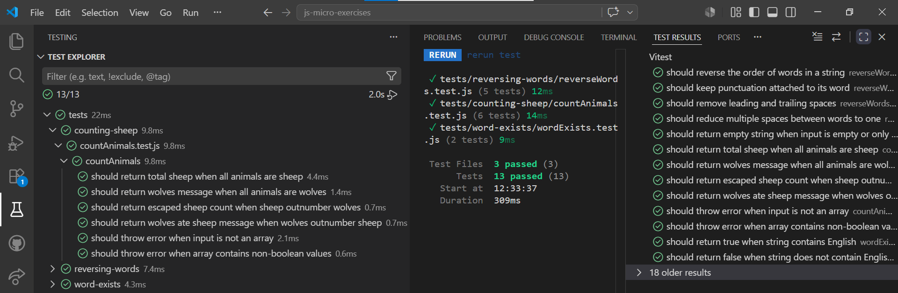

# 🐑 Counting Sheep · JavaScript + Vitest

_"True o false: de eso depende si hay cena esta noche."_

---

## 📖 Descripcion

Este ejercicio consiste en practicar el uso de condicionales y metodos de arrays mediante **TDD** (Test-Driven Development) con Vitest.

El reto: escribir una funcion que reciba un array de booleanos y devuelva un mensaje dependiendo de la cantidad de ovejas (`true`) y lobos (`false`) que haya.

Lo realizare con **JavaScript** y **Vitest**, aplicando **ES Modules**, **Conventional Commits** y **GitHub Flow**.

---

## 🔍 Analisis

Antes de escribir codigo analice el enunciado para identificar los casos de uso de la funcion y el algoritmo a seguir.

**Casos de uso de `countAnimals(animals)`:**

| Condicion | Resultado |
|---|---|
| Solo ovejas | `"There are X sheep in total"` |
| Solo lobos | `"UPS!!! A pack of hungry wolves"` |
| Mas ovejas que lobos | `"X sheep escaped!!!"` |
| Mas lobos que ovejas | `"UPS!!! Wolves ate all the sheep"` |
| Input no es array | Error: `"Invalid input: list must contain only boolean values"` |
| Array con valores no booleanos | Error: `"Invalid input: list must contain only boolean values"` |

**Reglas:**

- `true` representa una oveja, `false` representa un lobo
- Si todos son `true`, se cuentan las ovejas y se devuelve el total
- Si todos son `false`, los lobos ganaron sin resistencia
- Si hay mas `true` que `false`, algunas ovejas escaparon
- Si hay mas `false` que `true`, los lobos se comieron las ovejas
- Si el input no es un array o contiene valores no booleanos, se lanza un error

**Algoritmo:**

1. Recibir el parametro `animals`
2. Validar que `animals` es un array con `Array.isArray()` — si no lo es, lanzar un error
3. Validar que todos los elementos son booleanos con `.every()` — si alguno no lo es, lanzar un error
4. Contar las ovejas con `.filter(animal => animal === true).length`
5. Contar los lobos con `.filter(animal => animal === false).length`
6. Evaluar las condiciones en orden y devolver el mensaje correspondiente

**Paso a paso con los casos del enunciado:**

| Entrada | Ovejas | Lobos | Condicion | Salida |
|---|---|---|---|---|
| `[true, true]` | 2 | 0 | Solo ovejas | `"There are 2 sheep in total"` |
| `[false, false, false]` | 0 | 3 | Solo lobos | `"UPS!!! A pack of hungry wolves"` |
| `[true, true, false]` | 2 | 1 | Mas ovejas | `"2 sheep escaped!!!"` |
| `[true, false, false, false]` | 1 | 3 | Mas lobos | `"UPS!!! Wolves ate all the sheep"` |
| `"hola"` | — | — | No es array | Error |
| `[true, "oveja", 42]` | — | — | No booleanos | Error |

---

## 📐 Planificacion · Estructura del proyecto

- **`src/counting-sheep/countAnimals.js`** — funcion exportable `countAnimals(animals)` con la logica core
- **`tests/counting-sheep/countAnimals.test.js`** — seis tests con patron **AAA** (Arrange · Act · Assert)
- **`package.json`** — unico en la raiz, compartido por todos los ejercicios. No requiere cambios.

---

## 📋 Planificacion TDD

El orden sigue estrictamente **TDD**:

- 🔴 **Red** — se escribe el test primero, sin implementacion. El test falla.
- 🟢 **Green** — se escribe el codigo minimo necesario para que el test pase.
- 🔵 **Refactor** — se mejora el codigo de la funcion sin cambiar su comportamiento. Los tests siguen en verde.

---

## 📋 Planificacion de commits

**Rama `docs/counting-sheep`:**
- `docs`: add counting-sheep README with algorithm
- `docs`: update root README with counting-sheep entry

**Rama `feat/counting-sheep`:**
- `test`: add test for only sheep returns total count
- `feat`: implement countAnimals for only sheep case
- `refactor`: simplify sheep filter with Boolean
- `test`: add test for only wolves returns wolves message
- `feat`: add wolves case when no sheep found
- `refactor`: extract noSheep condition to readable variable
- `test`: add test for more sheep than wolves returns escaped count
- `feat`: add case for more sheep than wolves
- `refactor`: simplify if blocks and remove curly braces
- `test`: add test for more wolves than sheep returns wolves message
- `feat`: add case for more wolves than sheep
- `refactor`: remove unreachable return statement
- `test`: add test for non-array input throws error
- `feat`: add validation for non-array input
- `refactor`: simplify non-array validation if block
- `test`: add test for non-boolean values in array throws error
- `feat`: add validation for non-boolean values in array
- `refactor`: merge input validations into single condition
- `docs`: update counting-sheep README with final commits

**Rama `docs/counting-sheep-screenshots`:**
- `docs`: add test screenshots to counting-sheep README

---

## 🧪 Tests

Seis escenarios **BDD** con patron **AAA** (Arrange · Act · Assert):

| Escenario | Input | Output esperado |
|---|---|---|
| Solo ovejas | `[true, true]` | `"There are 2 sheep in total"` |
| Solo lobos | `[false, false, false]` | `"UPS!!! A pack of hungry wolves"` |
| Mas ovejas que lobos | `[true, true, false]` | `"2 sheep escaped!!!"` |
| Mas lobos que ovejas | `[true, false, false, false]` | `"UPS!!! Wolves ate all the sheep"` |
| Input no es array | `"hola"` | Error: `"Invalid input: list must contain only boolean values"` |
| Array con no booleanos | `[true, "oveja", 42]` | Error: `"Invalid input: list must contain only boolean values"` |

### 📸 Test Explorer

| Todos en verde |
|---|
|  |

---

## 🛠️ Tecnologias

- Git & GitHub
- VS Code
- JavaScript ES Modules
- Vitest
- Node.js