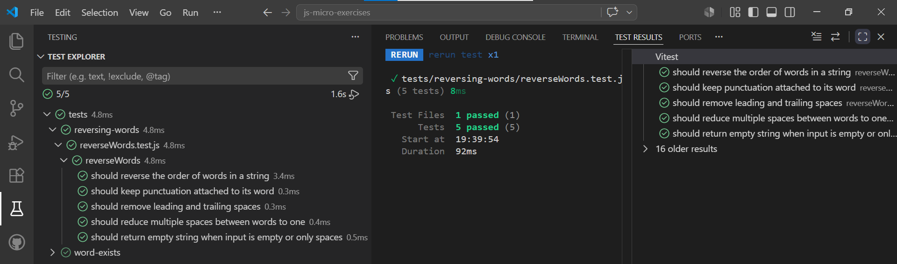

# 🔤 Reversing Words · JavaScript + Vitest

_"Invertir palabras: porque a veces el orden importa."_

---

## 📖 Descripción

Este ejercicio consiste en practicar la manipulación de strings y arrays mediante **TDD** (Test-Driven Development) con Vitest.

El reto: escribir una función que invierta el orden de las palabras de una cadena de texto, eliminando espacios innecesarios al principio, al final y entre palabras.

Lo realizaré con **JavaScript** y **Vitest**, aplicando **ES Modules**, **Conventional Commits** y **GitHub Flow**.

---

## 🔍 Análisis

Antes de escribir código analicé el enunciado para identificar los casos de uso de la función y el algoritmo a seguir.

**Casos de uso de `reverseWords(str)`:**

| Condición | Resultado |
|---|---|
| Cadena con dos palabras | Palabras en orden inverso |
| Cadena con puntuación pegada a una palabra | La puntuación se mantiene unida a su palabra |
| Cadena con espacios al principio y al final | Se eliminan los espacios extra |
| Cadena con múltiples espacios entre palabras | Se reduce a un único espacio entre palabras |
| Cadena vacía o solo espacios | Se devuelve una cadena vacía `""` |

**Reglas:**

- El orden de las palabras se invierte: la última pasa a ser la primera
- Los espacios al principio y al final se eliminan
- Múltiples espacios entre palabras se reducen a uno solo
- La puntuación se mantiene unida a su palabra
- Una cadena vacía o de solo espacios devuelve `""`

**Algoritmo:**

1. Recibir la cadena `str` como parámetro
2. Aplicar `.trim()` para eliminar espacios al principio y al final
3. Aplicar `.split(' ')` para separar las palabras en un array
4. Filtrar los elementos vacíos del array con `.filter()` — los espacios múltiples generan strings vacíos `""` al hacer el split
5. Invertir el array con `.reverse()`
6. Unir el array en un string con `.join(' ')`
7. Devolver el resultado

**Paso a paso con los casos del enunciado:**

| Entrada | `.trim()` | `.split()` + `.filter()` | `.reverse()` | `.join()` | Salida |
|---|---|---|---|---|---|
| `"Hello World"` | `"Hello World"` | `["Hello", "World"]` | `["World", "Hello"]` | `"World Hello"` | `"World Hello"` |
| `"Hi There."` | `"Hi There."` | `["Hi", "There."]` | `["There.", "Hi"]` | `"There. Hi"` | `"There. Hi"` |
| `"   espacios al rededor   "` | `"espacios al rededor"` | `["espacios", "al", "rededor"]` | `["rededor", "al", "espacios"]` | `"rededor al espacios"` | `"rededor al espacios"` |
| `"Muchos      espacios       intermedios"` | `"Muchos      espacios       intermedios"` | `["Muchos", "espacios", "intermedios"]` | `["intermedios", "espacios", "Muchos"]` | `"intermedios espacios Muchos"` | `"intermedios espacios Muchos"` |
| `""` | `""` | `[]` | `[]` | `""` | `""` |

> **Nota:** `.trim()` solo elimina espacios al principio y al final.
> Por eso `"Muchos      espacios       intermedios"` no cambia tras `.trim()` —
> sus espacios extra están en el interior. El `.filter()` es quien los elimina
> al descartar los strings vacíos `""` que genera `.split()` entre espacios múltiples.

---

## 📐 Planificación · Estructura del proyecto

- **`src/reversing-words/reverseWords.js`** — función exportable `reverseWords(str)` con la lógica core
- **`tests/reversing-words/reverseWords.test.js`** — cinco tests con patrón **AAA** (Arrange · Act · Assert)
- **`package.json`** — único en la raíz, compartido por todos los ejercicios. No requiere cambios.

---

## 📋 Planificación TDD

El orden sigue estrictamente **TDD**:

- 🔴 **Red** — se escribe el test primero, sin implementación. El test falla.
- 🟢 **Green** — se escribe el código mínimo necesario para que el test pase.
- 🔵 **Refactor** — se mejora el código de la función sin cambiar su comportamiento. Los tests siguen en verde.

---

## 📋 Planificación de commits

**Rama `docs/reversing-words`:**
- `docs`: add reversing-words README with algorithm
- `docs`: update root README with reversing-words entry

**Rama `feat/reversing-words`:**
- `test`: add test for basic word reversal
- `feat`: implement reverseWords basic reversal
- `refactor`: simplify reverseWords with chained methods
- `test`: add test for punctuation attached to word
- `test`: add test for leading and trailing spaces
- `feat`: add trim to handle leading and trailing spaces
- `refactor`: chain trim to reverseWords method
- `test`: add test for multiple spaces between words
- `feat`: add filter to handle multiple spaces between words
- `refactor`: chain filter to handle multiple spaces
- `test`: add test for empty string returns empty string

**Rama `docs/reversing-words-screenshots`:**
- `docs`: add test screenshots to reversing-words README

---

## 🧪 Tests

Cinco escenarios **BDD** con patrón **AAA** (Arrange · Act · Assert):

| Escenario | Input | Output esperado |
|---|---|---|
| Inversión básica | `"Hello World"` | `"World Hello"` |
| Puntuación unida a palabra | `"Hi There."` | `"There. Hi"` |
| Espacios al principio y al final | `"   espacios al rededor   "` | `"rededor al espacios"` |
| Múltiples espacios entre palabras | `"Muchos      espacios       intermedios"` | `"intermedios espacios Muchos"` |
| Cadena vacía o solo espacios | `""` | `""` |

### 📸 Test Explorer

| Todos en verde |
|---|
|  |

---

## 🛠️ Tecnologías

- Git & GitHub
- VS Code
- JavaScript ES Modules
- Vitest
- Node.js