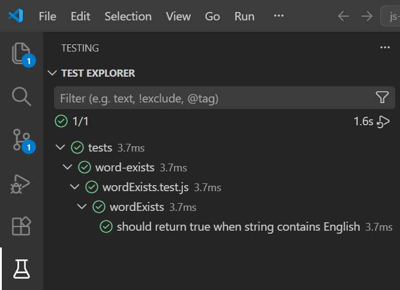
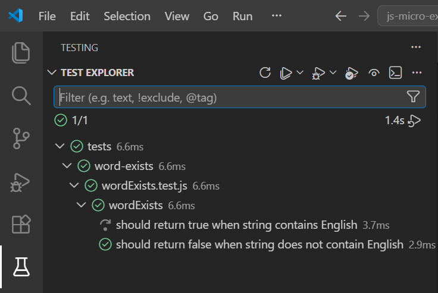

# 🔤 Word Exists · JavaScript + Vitest

_"¿Está 'English' ahí dentro? Solo hay una forma de saberlo."_

----------

## 📖 Descripción

Este ejercicio consiste en practicar la búsqueda de subcadenas en strings mediante **TDD** (Test-Driven Development) con Vitest.

El reto: escribir una función que determine si una cadena de texto contiene la palabra **"English"**, cubriendo un caso positivo y uno negativo con tests unitarios escritos antes que el código.

Lo realizaré con **JavaScript** y **Vitest**, aplicando **ES Modules**, **Conventional Commits**, **GitHub Flow**.

----------

## 🔍 Análisis

Antes de escribir código analicé el enunciado para identificar los casos de uso de la función y el algoritmo a seguir.

**Casos de uso de `wordExists(str)`:**

| Condición | Resultado |
|---|---|
| La cadena contiene `"English"` | `true` |
| La cadena no contiene `"English"` | `false` |

**Reglas:**

- El orden de los caracteres es importante: `"abcEnglishdef"` es correcto, `"abcnEglishsef"` no lo es
- Es insensible a mayúsculas y minúsculas: `"eNgLiSh"` también se considera correcto
- Devuelve un booleano: `true` si la cadena contiene "English", `false` en caso contrario

**Algoritmo:**

1. Recibir la cadena `str` como parámetro — puede contener cualquier carácter ASCII y cualquier combinación de mayúsculas y minúsculas
2. Convertir `str` a minúsculas con `.toLowerCase()` — así normalizamos la cadena y la búsqueda es insensible a mayúsculas: `"English"`, `"ENGLISH"` o `"eNgLiSh"` se tratan igual
3. Comprobar si la cadena normalizada contiene la subcadena `"english"` con `.includes()` — este método respeta el orden de los caracteres, por lo que `"abcEnglishdef"` es correcto pero `"abcnEglishsef"` no lo es
4. Devolver el resultado booleano — `true` si la cadena contiene "English", `false` en caso contrario

**Paso a paso con los casos del enunciado:**

| Cadena original | Tras `.toLowerCase()` | Contiene `"english"` | Resultado |
|---|---|---|---|
| `"abcEnglishdef"` | `"abcenglishdef"` | Sí | `true` |
| `"abcnEglishsef"` | `"abcneglishsef"` | No | `false` |
| `"eNgLiSh"` | `"english"` | Sí | `true` |

----------

## 📐 Planificación · Estructura del proyecto

Estructura de archivos decidida antes de programar:

- **`src/word-exists/wordExists.js`** — función exportable `wordExists(str)` con la lógica core
- **`tests/word-exists/wordExists.test.js`** — dos tests con patrón **AAA** (Arrange · Act · Assert): un caso positivo y uno negativo
- **`package.json`** — configuración del proyecto
- **`README.md`** — documentación del proyecto

El orden sigue estrictamente **TDD**:

- 🔴 **Red** — se escribe el test primero, sin implementación. El test falla.
- 🟢 **Green** — se escribe el código mínimo necesario para que el test pase.
- 🔵 **Refactor** — se mejora el código sin cambiar su comportamiento. Los tests siguen en verde.

----------

## 📋 Planificación de commits

- `chore`: setup vitest
- `docs`: add root README
- `docs`: add word-exists README with algorithm
- `test`: add test for string containing English returns true
- `feat`: implement wordExists function
- `refactor`: extract condition to readable variable
- `docs`: update README positive case with screenshot
- `test`: add test for string not containing English returns false
- `refactor`: update wordExists readable condition
- `docs`: update README negative case with screenshot
- `docs`: add final screenshot to README

----------

## 🧪 Tests

Dos escenarios **BDD** con patrón **AAA** (Arrange · Act · Assert):

| Escenario | Input | Output esperado |
|---|---|---|
| Caso positivo | `"abcEnglishdef"` | `true` |
| Caso negativo | `"abcnEglishsef"` | `false` |

### 📸 Test Explorer

| Caso positivo | Caso negativo | Todos en verde |
|---|---|---|
|  |  |  |

----------

## 🛠️ Tecnologías

- Git & GitHub
- VS Code
- JavaScript ES Modules
- Vitest
- Node.js